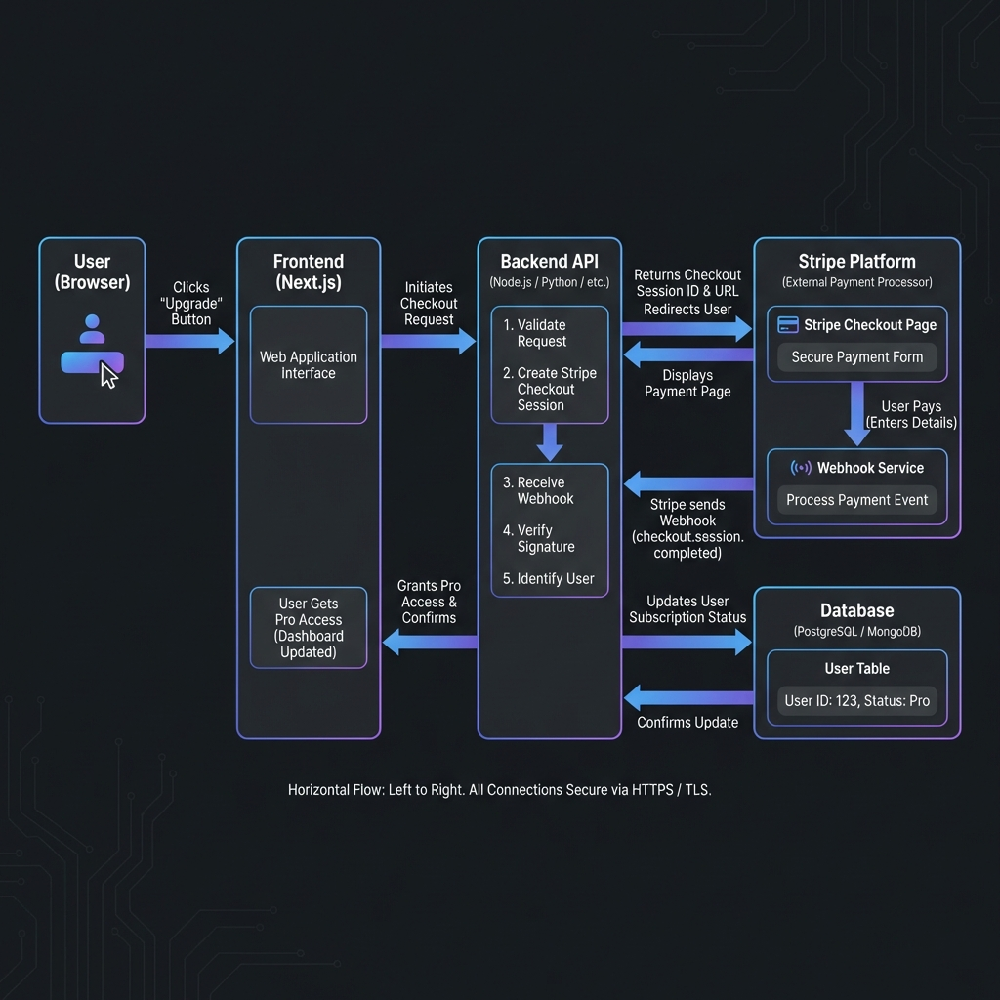
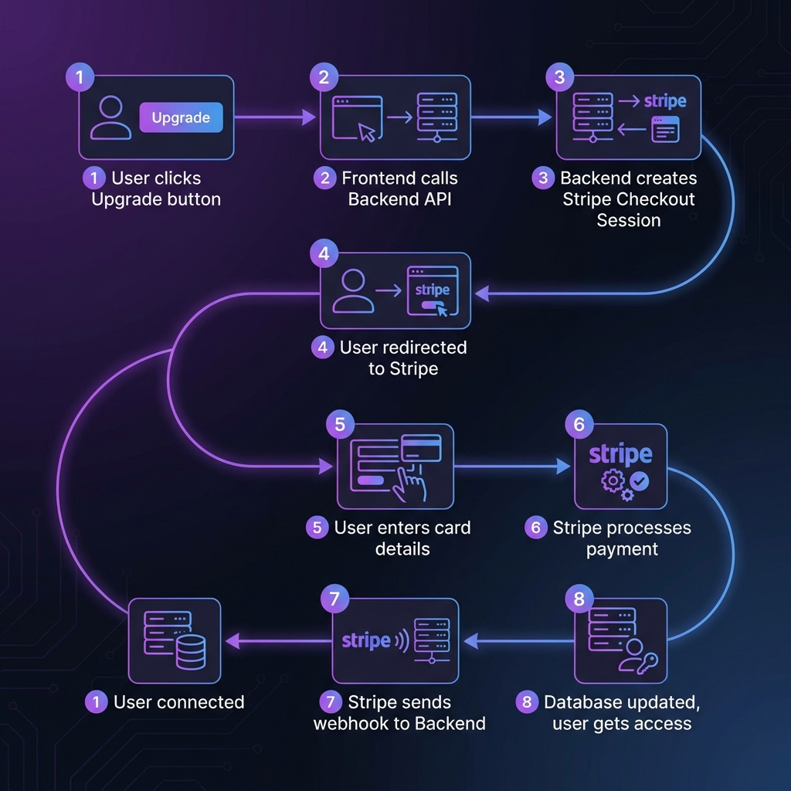
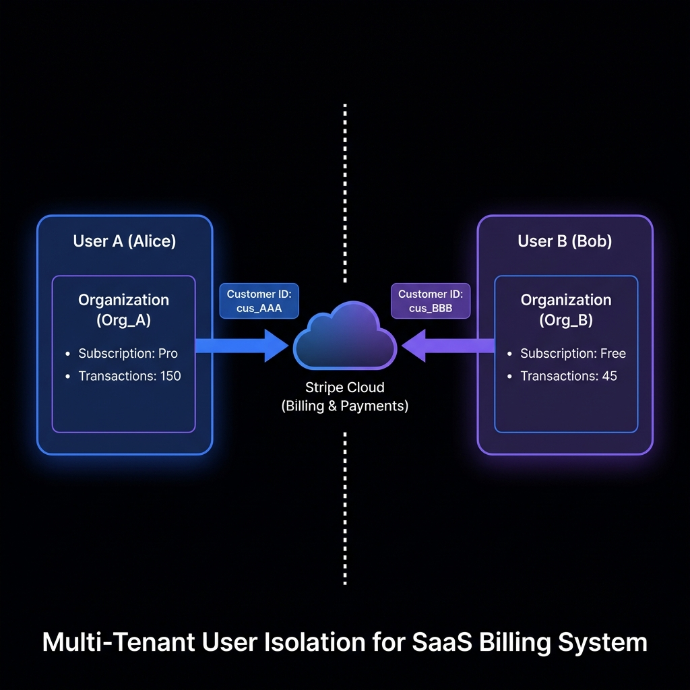

# 💳 Stripe Payment Integration Guide for Vessify

## 🏗️ System Architecture

This diagram shows how all the pieces connect together:



**What's happening here:**

1. **User (Browser)** - The person using app who wants to upgrade
2. **Frontend (Next.js)** - Vessify frontend that shows the "Upgrade" button
3. **Backend API (Hono)** - Vessify server that talks to Stripe securely
4. **Stripe Platform** - Stripe's checkout page where users enter their card
5. **Database** - Where you store who has paid and who hasn't

**Why this architecture?**
- Your frontend NEVER touches credit card details (security!)
- Stripe handles all the payment complexity
- Webhooks ensure your database stays in sync even if the user closes their browser mid-payment

---

## 🔄 Payment Flow (Step by Step)

This shows exactly what happens when a user pays:



### Detailed Explanation:

| Step | What Happens | Why It Matters |
|------|-------------|----------------|
| **1** | User clicks "Upgrade to Pro" button | Triggers the whole payment process |
| **2** | Frontend sends POST request to your backend | Keeps Stripe keys secure (never on frontend) |
| **3** | Backend creates a "Checkout Session" with Stripe | Tells Stripe: "this user wants to buy X plan" |
| **4** | User is redirected to Stripe's checkout page | Stripe handles the scary credit card stuff |
| **5** | User enters card details on Stripe's secure page | You never see or store card numbers |
| **6** | Stripe processes the payment | Card charged, money goes to your account |
| **7** | Stripe sends a "webhook" to your backend | "Hey, this user just paid successfully!" |
| **8** | Your backend updates the database | Mark user as "Pro" subscriber |

### The Critical Part: Webhooks

**Why not just update the database when user returns from Stripe?**

- User might close the browser before coming back
- User's internet might disconnect
- The redirect might fail

**Webhooks solve this:** Stripe directly tells your server "payment succeeded" - it's reliable even if the user disappears.

---

## 🔐 How Each User Stays Separate

This is the most important part - making sure Alice can't see Bob's subscription:



### The Key Concept: Organization-based Billing

In Vessify, you already have **Organizations**. Here's how subscriptions connect:

```
User → belongs to → Organization → has one → Subscription → linked to → Stripe Customer
```

**What this means:**

| User | Organization | Stripe Customer ID | Subscription |
|------|-------------|-------------------|--------------|
| Alice | Alice's Org | `cus_AAA123` | Pro ($9.99/mo) |
| Bob | Bob's Org | `cus_BBB456` | Free |
| Carol | Carol's Org | `cus_CCC789` | Pro ($9.99/mo) |

**Each organization gets its own Stripe Customer ID** - this is the magic that keeps billing separate.

### Why Organization, not User?

This design choice lets you add **team billing** later:
- Multiple people can be in one organization
- The org admin pays for everyone
- All team members share the Pro features

---

## 📊 What Changes in Your Database

You need ONE new table called `Subscription`:

| Field | What It Stores | Example |
|-------|---------------|---------|
| `organizationId` | Which org this subscription belongs to | `org_abc123` |
| `stripeCustomerId` | Stripe's unique ID for this customer | `cus_AAA123` |
| `stripeSubscriptionId` | Stripe's ID for this specific subscription | `sub_xyz789` |
| `status` | Is it active, cancelled, past due? | `active` |
| `plan` | What plan are they on? | `pro` |
| `currentPeriodEnd` | When does this billing cycle end? | `2025-02-18` |

**One-to-One relationship:** Each Organization has exactly ONE Subscription (or none if they never upgraded).

---

## 🚦 When to Block Features (Paywall Logic)

Here's how you decide if a user can use premium features:

### The Decision Tree

```
Is user logged in?
├── NO → Show login page
└── YES → Check their organization's subscription
          ├── subscription.status === "active"?
          │   ├── YES → ✅ Allow premium feature
          │   └── NO → Check free tier limits
          │            ├── Under limit? → ✅ Allow (limited)
          │            └── Over limit? → ❌ Show paywall
```

### Practical Example (Transaction Extraction)

| User | Plan | Extractions This Month | Can They Extract More? |
|------|------|----------------------|----------------------|
| Alice | Pro | 500 | ✅ Yes (unlimited) |
| Bob | Free | 30 | ✅ Yes (under 50 limit) |
| Carol | Free | 50 | ❌ No (limit reached, show upgrade) |

### What to Show When Blocked

When a free user hits their limit:
- **402 status code** (Payment Required)
- Friendly message: "You've used all 50 free extractions this month"
- Clear CTA button: "Upgrade to Pro for unlimited extractions"
- Show what they'll get: unlimited extractions, exports, etc.

---

## 🛠️ Implementation Checklist

### Backend Changes Needed:

1. **New file: `src/lib/stripe.ts`**
   - Initialize Stripe SDK with your secret key
   - Define your plans (Free, Pro, etc.)

2. **New file: `src/routes/stripe.ts`**
   - `POST /api/stripe/checkout` - Create checkout session
   - `GET /api/stripe/status` - Get user's subscription status
   - `POST /api/stripe/portal` - Let users manage their subscription

3. **New file: `src/routes/webhook.ts`**
   - `POST /api/webhook/stripe` - Receive Stripe events
   - Handle: `checkout.session.completed`, `subscription.updated`, `subscription.deleted`

4. **Update: `src/routes/transactions.ts`**
   - Check subscription before allowing extraction
   - Return 402 if over limit

5. **Update: `prisma/schema.prisma`**
   - Add Subscription model
   - Add relation to Organization

### Frontend Changes Needed:

1. **New page: `/pricing`**
   - Show Free vs Pro comparison
   - Upgrade button that calls backend

2. **New hook: `useSubscription()`**
   - Fetch and cache subscription status
   - Make it easy to check `isPro` anywhere in app

3. **Update: Dashboard**
   - Show "X extractions remaining" for free users
   - Show upgrade prompt when approaching limit

---

## 🔑 Environment Variables You'll Need

| Variable | What It Is | Where to Get It |
|----------|-----------|-----------------|
| `STRIPE_SECRET_KEY` | Your private API key | Stripe Dashboard → Developers → API Keys |
| `STRIPE_PUBLISHABLE_KEY` | Public key for frontend (optional) | Same place |
| `STRIPE_WEBHOOK_SECRET` | Validates webhooks are really from Stripe | Stripe Dashboard → Webhooks → Your endpoint |
| `STRIPE_PRO_PRICE_ID` | The ID of your Pro plan price | Stripe Dashboard → Products → Your product → Price ID |

---

## 📋 Stripe Dashboard Setup Steps

1. **Create Account** at [stripe.com](https://stripe.com)

2. **Create a Product:**
   - Dashboard → Products → Add Product
   - Name: "Vessify Pro"
   - Add a Price: $9.99/month recurring

3. **Get Your API Keys:**
   - Dashboard → Developers → API Keys
   - Copy the Secret Key (starts with `sk_test_` or `sk_live_`)

4. **Set Up Webhook:**
   - Dashboard → Developers → Webhooks
   - Add endpoint: `https://your-domain.com/api/webhook/stripe`
   - Select events: `checkout.session.completed`, `customer.subscription.*`

5. **Enable Customer Portal:**
   - Dashboard → Settings → Billing → Customer portal
   - This lets users cancel/manage subscriptions themselves

---


## 📚 Summary

| Concept | Implementation |
|---------|---------------|
| **User pays** | Checkout Session → Stripe Checkout → Webhook → Database |
| **User separated** | Each Organization has unique `stripeCustomerId` |
| **Check access** | Query Subscription table, check `status === 'active'` |
| **Free limits** | Count transactions this month, compare to limit |
| **Manage subscription** | Stripe Customer Portal handles cancellation/updates |
